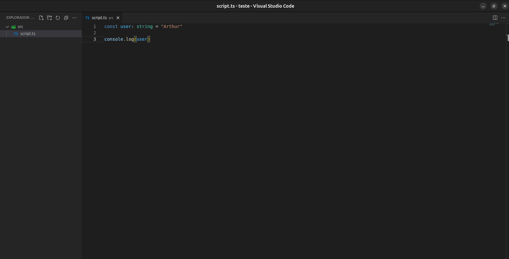

[CONFIGS__BADGE]: https://img.shields.io/badge/configs-000?style=for-the-badge&logo=html
[EXTENSIONS__BADGE]: https://img.shields.io/badge/extensions-000?style=for-the-badge&logo=code
[KEYBINDS__BADGE]: https://img.shields.io/badge/keybinds-000?style=for-the-badge&logo=code
[SNIPPETS__BADGE]: https://img.shields.io/badge/snippets-000?style=for-the-badge&logo=code

<p align="center">
    
</p>

<p align="center">
<b>Este é o repositório das minhas configurações no VSCODE 🚀👩‍💻</b>
</p>

<h2 id="descricao">📝 Descrição</h2>
<p>Meu VSCode é minimalista com foco em produtividade, aqui estão estão disponíveis os arquivos de configuração por mim utilizados. Muitas das alterações na UI somente são possíveis por meio da extensão Apc Customize UI++, <b>sendo obrigatória para que algumas mudanças possam ser aplicadas.</b></p>

<h3>Preview</h3>


<h2 id="documentacoes">💻 Arquivos</h2>

[![configs][CONFIGS__BADGE]](./configs.md) <br>
[![extensions][EXTENSIONS__BADGE]](./extensions.md) <br>
[![keybinds][KEYBINDS__BADGE]](./keybinds.md) <br>
[![snippets][SNIPPETS__BADGE]](./snippets.md)

<h2 id="contribute">🚀 Desenvolvedor</h2>

Este projeto foi desenvolvido por [Arthur Candeia](https://arthur-candeia.com.br).

```bash
Portfólio - https://arthur-candeia.com.br
99freelas - https://www.99freelas.com.br/user/arthur-candeia
E-mail - arthurheher@hotmail.com
Telefone - (27) 99864-2163
```

Este respositório segue o [Commit pattern](https://gist.github.com/joshbuchea/6f47e86d2510bce28f8e7f42ae84c716) para os commit's realizados.